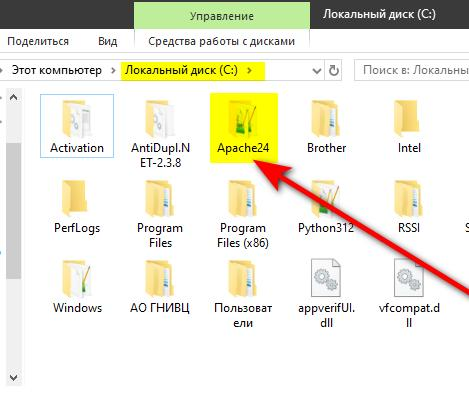
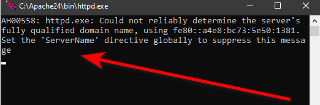
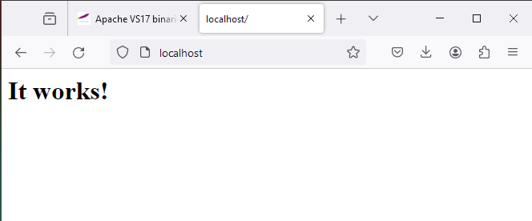
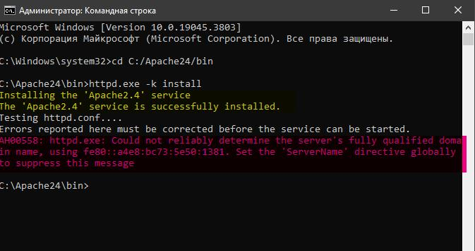
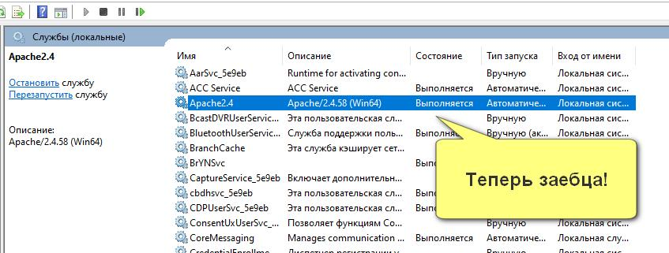

# On Windows 10

Официальный сайт apache говорит: "Ребята на Windows, хуй вам, а не дистрибутив Апача. Качайте исходники, петушары, и учитесь собирать бинарники сами. А если не умеете - пиздуйте на братские нам сайты и качайте ихние Windows сборки".

Окей, погнали. Пиздуем на [https://www.apachelounge.com/download/](https://www.apachelounge.com/download/) ибо тот предлагает голый дистриб Апача безо всякой дополнительной шняги.

Скачали zip архив, распаковали, читаем Readme.txt нах:

1. You must first install the Visual C++ Redistributable for Visual Studio 2015-2022 x64. Download and Install, if you have not done so already, see: https://www.apachelounge.com/download/[^1]
2. [Unzip the Apache24 folder to c:/Apache24 (that is the ServerRoot in the config). The default folder for your your webpages is DocumentRoot "c:/Apache24/htdocs". ](#user-content-fn-2)[^2]&#x20;

<figure><figcaption></figcaption></figure>

Короче, если хочется поместить папку Apache24 в другое место, то надо в файле httpd.conf Прописать новый путь:

<figure><figcaption></figcaption></figure>

<figure><figcaption></figcaption></figure>

### Запуск и тестирование

1. Фактически надо просто запустить файл c:\Apache24\bin\httpd.exe любым удобным вам способом. Например через командную строку: Win+R -> cmd -> cd C:/Apache24/bin -> httpd.exe&#x20;
2. В случае каких-либо ошибок, они будут выведены на экран, в случае предупреждений - они также будут выведены на экран, но работа Apache не будет прервана. Курсор в консоли должен просто начать мигать на следующей линии. В моем случае я получил вот такое предупреждение:

<figure><figcaption>
Да ну и хуй с ним!
</figcaption></figure>

3. Запустим наш любимый браузер и в адресной строке напечатаем: [http://localhost](http://localhost)

<figure><figcaption></figcaption></figure>

4. <mark style="color:red;">**Заебца, всё работает!**</mark> Что дальше?
5. Остановить Apache можно нажав в окне консоли, откуда запускали **httpd.exe** комбинацию **CTRL+C.** Скорее всего придется выждать какой-то промежуток времени, прежде чем веб-сервер остановится.
6. Всё это, конечно, прикольно, но не прикольно каждый раз запускать httpd.exe вручную. Поэтому установим его, как службу Windows. Для этого в нашей любимой консоли запустим его с параметрами: httpd.exe **-k install.** Тут есть нюанс: консоль надо запустить <mark style="background-color:orange;">с правами администратора:</mark> Press the start button (**кнопка с квадратиками**). In the search box type "**cmd**", then press **Ctrl+Shift+Enter**!

<figure><figcaption></figcaption></figure>

7.  Служба установлена, но не запущена! Поэтому: You can start/stop the service with the command:

    > services.msc

<figure><figcaption></figcaption></figure>

<figure><figcaption></figcaption></figure>

[^1]: 

[^2]: When you unzip to an other location: change Define SRVROOT "c:/Apache24" in httpd.conf, for example to "E:/Apache24"
